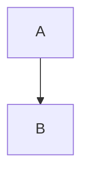

Welcome to PySilentSubstitution!
================================


[](https://zenodo.org/badge/latestdoi/390693759) [](https://badge.fury.io/py/pysilsub) [](./CODE_OF_CONDUCT.md)  [](https://pypi.com/project/pip/) [](https://pypi.python.org/pypi/ansicolortags/) 


*PySilSub* is a Python software for performing the method of silent substitution with any multiprimary stimulation system for which accurate calibration data are available. Solutions are found with linear algebra and numerical optimisation via a flexible, intuitive interface:



```Python
from pysilsub.problem import SilentSubstitutionProblem as SSP

problem = SSP.from_package_data('STLAB_1_York')  # Load example data
problem.ignore = ['R']  # Ignore rod photoreceptors
problem.minimize = ['S', 'M', 'L']  # Minimise cone contrast
problem.modulate = ['I']  # Target melnopsin
problem.target_contrast = .3  # With 30% contrast 
solution = problem.optim_solve()  # Solve with optimisation
fig = problem.plot_solution(solution)  # Plot the solution
```


Another example: 

```Python
problem.background = [.5] * problem.nprimaries  # Half-max all channels
problem.ignore = ['R']  # Ignore rod photoreceptors
problem.minimize = ['M', 'L', 'I']  # Minimise L-cone, M-cone, and melanopsin
problem.modulate = ['S']  # Target S-cones
solution = problem.linalg_solve()  # Solve with linear algebra
fig = problem.plot_solution(solution.x)  # Plot the solution
```

There are many other features and use cases covered. The package also includes 6 example datasets for various multiprimary systems, so you can run the above code after a simple pip install:

```bash
pip install pysilsub
```

For further information, take a look at the GitHub repository and documentation pages. 

Important note
--------------

This is a test release and should not be used for production.

